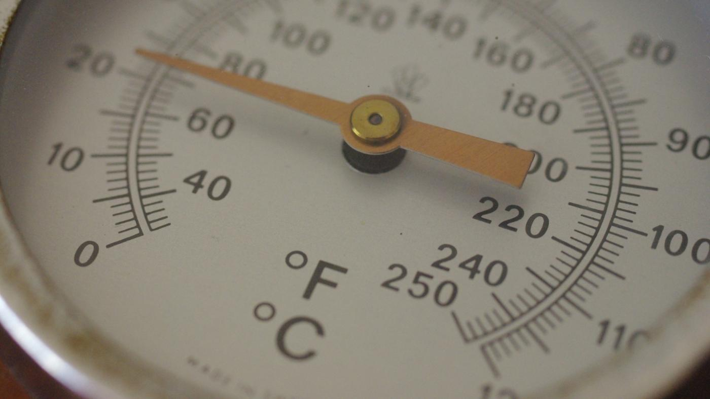

**77/365** Chiar dacă suntem deja în secolul 21, omenirea încă nu a ajuns la un numitor comun privind unele **unităţi de măsură**, ceea ce deseori cauzează dificultăţi.
Astfel, pentru lungime se folosesc kilometri, mile (~1.6km) şi mile de mare (1.85km). Centimetri şi inch (2.54cm).
Pentru volum - litri, galoane imperiale (4.54l), galoane SUA (3.78l).
Pentru greutate - kilograme, pound (0.45kg). Tone, tone SUA (907kg), tone imperiale (1016kg).
Pentru temperatură - grade Celsius, Kelvin şi Fahrenheit.

