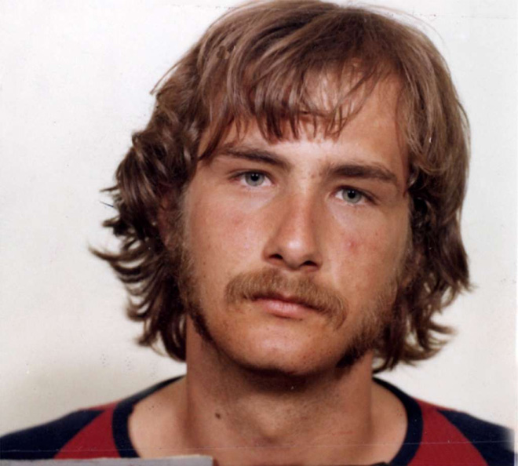

**78/365 William Stanley Milligan**, unul dintre cei mai cunoscuţi pacienţi cu dedublarea personalităţii din istorie s-a născut la 14 februarie 1955 la Florida, SUA. La sfârşit anilor '70, acesta era culpabil pentru câteva furturi şi trei violuri. Totuşi, avocaţii acestuia au declarat că clientul lor suferă de dedublarea personalităţii şi că crimele au fost comise de alte identităţi care coexistă în acelaşi corp cu William. Numărul identităţilor se ridica la 24, dintre care 10 erau de bază. Totodată, el a fost primul om care a scăpat de pedeapsă din cauza dedublării personalităţii. William a petrecut 10 în psihiatrie, după care a fost eliberat şi declarat sănătos. Unele din identităţile sale erau:
- Arthur - un tânăr de 22 de ani, englez bine educat, expert în medicină şi ştiinţe. De sine stătător a studiat limba arabă şi suahili. Cu ajutorul deducţiei, şi-a dat seama că nu e unica identitate în corp şi le-a descoperit pe celelalte. Fuma lulea. Ateu.
- Ragen Vadascovinich - de naţionalitate iugoslav, 23 de ani. Când vorbea engleza, avea un accent puternic slavon. Suferea de daltonism. Comunist, Expert în arme, sportiv.
- Allen - 18 ani. Infractor, manipulator. Agnostic. Pictează portrete, toboşar. Unicul dreptaci şi unicul care fumează ţigări.
- Tommi - 16 ani. Cântă la saxofon, pictează peizaje.
- Danny - un băiat de 14 ani, speriat, se teme de oameni, în special de bărbaţi. Pictează doar natură moartă-
- Adalana - lesbiană de 19 ani. Găteşte, scrie poiezii. Se spune că anume această personalitate a violat, având nevoie de dragoste şi compasiune.

Pe lângă aceste personalităţi, în corpul lui William, mai existau şi identităţi de diferite naţionalităţi, precum un evreu, australian, african.

După eliberare, acesta o perioadă de timp a locuit la California unde avea o companie mică de filmări, după care declarase firma falită şi rupse orice legătură cu prietenii şi cunoştinţele sale. În 2014 la un post de televiziune a fost adusă la cunoştinţă ştirea că William a decedat la 59 de ani din cauza canerului.

