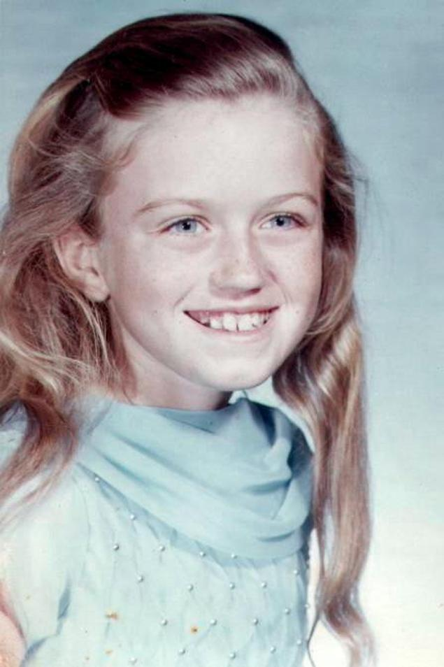

**79/365 Edwarda O'Bara** a devenit cunoscută datorită faptului că a petrecut în stare de comă cea mai mare parte a vieţii sale şi a celei mai lungi come din istorie. La vârsta de 16 ani, fiind bolnavă de diabet şi pneumonie, Edwarda a intrat în comă pentru următorii 42 de ani al vieţii sale, în cazul care putem numi aceasta stare drept viaţă, şi din care nu s-a mai trezit niciodată până la moartea sa survenită la vârsta de 59 de ani.
La 20 decembrie 1969, la miez de noapte, aceasta s-a trezit cu dureri insuportabile, din cauza că insulina pe care şi-o administra pe cale orală nu a ajuns la sistemul sangvin. Înainte ca Edwarda să intre în comă, aceasta şi-a rugat mama să nu o lase singură. Mama sa şi-a ţinut promisiunea de a avea grijă de ea pentru următorii 35 de ani. După moartea mamei sale, Edwarda a fost îngrijită de sora sa până când a decedat la vârsta de 59 de ani.

