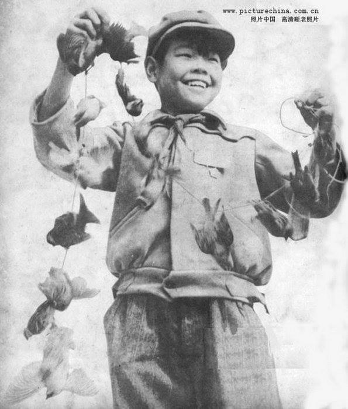

**8/365** În timp ce australienii aşa şi nu au reşit să distrugă numărul enorm de iepuri care au pus stăpânire pe Australia, chinezii au fost mai iscusiţi la capitolul dat, în lupta cu vrăbiile. În anul 1958, Mao Zedong, liderul comunist al Chinei, a emis un ordin ca toate vrăbiile să fie omorâte pe motiv că mănâncă foarte multe cereale. Potrivit lui, vrăbiile erau cauza sărăciei şi lipsei de alimente din ţară. Astfel, dacă chinezii aveau să omoare toată vrăbiile, dezvoltarea economică a statului nu v-a întârzia să apară. Toţi cetăţenii erau chemaţi să omoare vrăbiile şi să prezinte la un centru anumit, ca dovadă, gheara stângă. Pentru un anumit număr de gheare, aceştiau primeau o recompensă. Un ziar informa cetăţenii că doar într-o singură zi, la 13 decembrie 1958, la centre au fost aduse în jur de 194.000 de gheare! Pe toată durata campaniei, au fost distruse sute de milioane de păsări, iar lipsa acestora nu s-a lăsat desigur mult aşteptată. În următorul an, din cauza lispei păsărilor, care se hrănesc cu insecte, inclusiv lăcuste, culturile au fost grav afectate. Numărul lăcustelor a crescut şi au distrus aproape toate culturile, ceea ce a dus la foamete în ţară între anii 1959-1961. Datele despre numărul concret de oameni care au decedat din cauza foametei nu este cunoscut cu exactitate, dar conform diferitor surse, acesta variază între 10 şi 45 de milioane de oameni. Interesant este faptul că deficitul vrăbiilor se face simţit şi în ziua de astăzi, astfel pentru combaterea dăunătorilor se folosesc pesticide.

