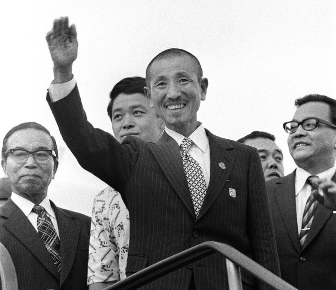

**80/365** Chiar dacă al doilea război mondial s-a încheiat oficial la 2 septembrie 1945, odată cu capitularea Japoniei, Hirō Onoda a continuat să lupte cu duşmanul american încă 29 de ani. În decembrie 1944, Onoda cu un grup mic de soldaţi, a fost trimis pe insula Lubang, Filipine. Când americanii au ocupat insula, în februarie 1945, Onoda şi cu încă câţiva soldaţi s-au retras în pădurea deasă care acoperea o mare parte a insulei. Datorită unui aparat de radio, aceştia au aflat despre sfârşitul războiului, dar au interpretat mesajul ca o informaţie care avea ca scop să-i inducă în eroare. Ordinul primit de Onoda îi interzicea să se sinucidă şi era obligat să aştepte până armata japoneză se v-a întoarce după ei. În pădure, în timp ce-şi aşteptau camarazii, aceştia se hrăneau cu nuci de cocos, banane, şi uneori, când aveau mai mult noroc, cu carne din vânat. Interesant e şi faptul, că Onoda cu soldaţii săi atacau populaţia insulei, ucigând în total în jur de 30 de oameni. Totuşi, şi doi soldaţi din echipa lui Onoda au fost împuşcaţi, în 1954 şi respectiv 1972. În 1974, un turist japonez, care venise cu scopul să-l găsească pe Onoda, a dat de el în pădurea unde acesta se ascundea deja de 29 de ani. Când Suzuki, aşa se numea turistul, l-a întrebat pe Onoda de ce acesta nu încetează lupta, acesta a răspuns că nu a primit ordinul pentru a lăsa arma. Aşa că, Suzuki s-a întors de urgenţă în Japonia, unde l-a găsit pe fostul comandant al acestuia, maiorul Taniguchi, care la acel moment lucra ca vânzător de cărţi şi i-a transmis informaţia pe care o deţinea. La 9 martie 1974, Onoda a auzit vocea maiorului Taniguchi care i-a ordonat să se predea. A doua zi, acesta se predase armatei filipineze. Onoda s-a întors într-o altă Japonie, după aproape 30 de ani, dar neputând să se adapteze, s-a mutat cu traiul în Brazilia, acolo unde s-a căsătorit şi şi-a deschis propria afacere. În 2004, autorităţile braziliene l-au decorat pe Onoda cu ordinul Santos-Dumont, cel mai important ordin civil din Brazilia. Onoda a decedat la 16 ianuarie 2014, cu doar două luni înainte de a împlini vârsta de 92 de ani.

