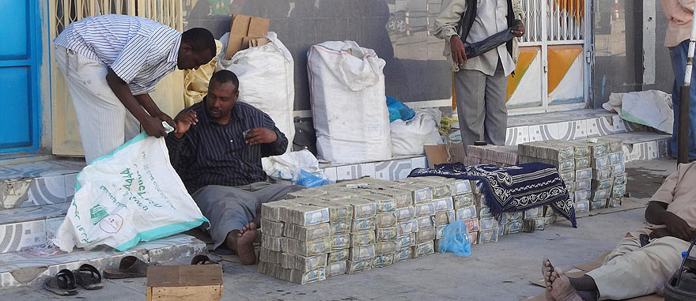

**81/365** În mod normal, chiar şi **inflaţia** de doar câteva procente reprezintă o problemă pentru economie. Totuşi, Zimbabwe a avut una din cele mai mari inflaţii din istorie, ajungând la situaţia când hârtia şi procesul de tipărire a unei banconte costa mai mult decât valoarea ei. În anul 2008 inflaţia a ajuns la 231 milioane procente, iar în ianuarie 2009 a fost lansată banconata de 100 de trilioane de dolari zimbabwieni, care valorau doar 25 cenţi americani. Într-un final, conducerea ţării a hotărât să renunţe la valuta naţională, fapt care a dus la îmbunătăţirea situaţiei, astfel că în 2011 inflaţia a fost doar de 5.4%.Chiar dacă hiperinflaţia din Zimbabwe e greu de înţeles pentru majoritatea din noi, să ştiţi că în anul 1946 în Ungaria, hiperinflaţia a atins cote colosale, astfel că 20 de octilioane de pengheu valorau doar 4,35 cenţi americani.

