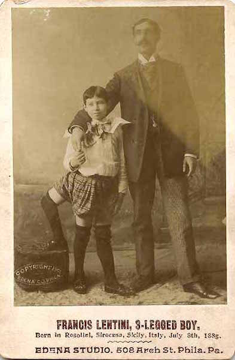

**82/365** Începând cu secolul al XIII-lea, pe stema insulei Sicilia sunt reprezentante trei picioare alergând. Interesant este faptul că anume în Sicilia, în 1889 s-a născut viitorul actor de circ **Francesco Lentini** care avea trei picioare şi şaisprezece degete. Părinţii acestuia aveau 12 copii, dar doar el avea dizabilităţi. Acest lucru se datorează faptului că în acelaşi moment se dezvoltau doi gemeni, dar la un moment dat unul din ei a concrescut în celălalt. La sfârşitul secolului XIX doctorii cunoşteau deja astfel de cazuri, dar la acel timp o operaţie putea să-l coste viaţa. Părinţii lui s-au dezis de el, iar mătuşa care a dorit să-l îngrijească, l-a dat mai târziu la casa de copii cu dizabilităţi. Cât de straniu ar putea suna, totuşi, anume în acel loc, el a început să iubească viaţa şi trupul său, văzând starea celorlalţi copii. Francesco a învăţat să alerge, să sară coarda, să meargă pe bicicletă şi să joace fotbal. Toate acestea i-au fost de folos când s-a mutat în SUA şi s-a alăturat unui trupe de circ. Avea simţul umorului dezvoltat, iar la întrebarea cum cumpără trei pantofi, răspundea că cumpără două perechi, iar a patrulea pantof îl dăruieşte unui prieten cu un singur picior. A fost căsătorit de două ori şi a avut patru copii fără careva probleme de sănătate. Francesco a decedat la vârsta de 78 de ani.

