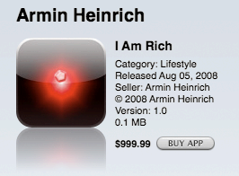

**83/365** La 5 august 2008, în App Store a fost lansată aplicaţia "I am rich", dezvoltată de Armin Heinrich. Aceasta avea un preţ de $999.99, €799.99 sau £599.99 şi unicul lucru pe care-l putea face era să afişeze un text:
"I am rich
I deserv [sic] it
I am good,
healthy & successful".
Aplicaţia a fost cumpărată de opt ori, iar o persoană a afirmat că a cumpărato din greşeală, fapt care i-a adus dezvolatorului 5.600$ şi 2.400$ companiei Apple. Totuşi, la doar o zi de la lansare, aplicaţia a fost scoasă din vânzare de compania Apple fără vreo explicaţie. Unii au criticat aplicaţia ca fiind o glumă de prost gust şi cu un preţ exagerat. Peste un an, Heinrich a lansat o altă versiune a aplicaţiei, I am rich LE, care costa $9.99 şi care pe lângă acelaşi text care de data aceasta nu mai conţinea greşeli gramaticale, un calculator şi informaţii despre cum să fie folosită aplicaţia.

