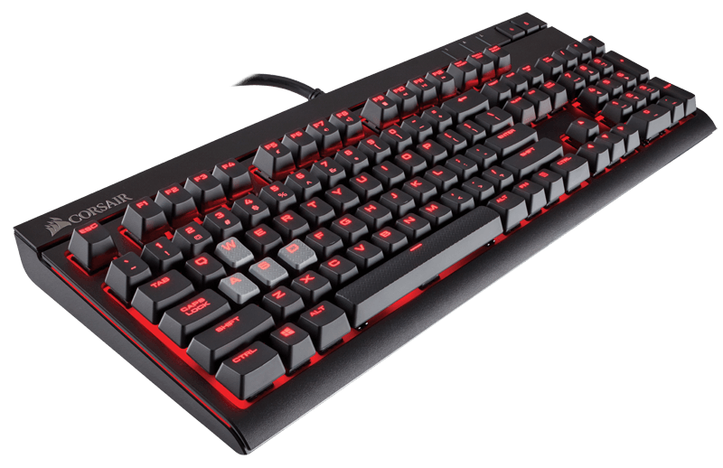

**84/365** Interesant este faptul că butoanele pe tastatură sunt ordonate astfel pentru că viteza scrierii să fie mai înceată. Problema vine din timpurile maşinilor de scris care iniţial aveau butoanele aranjate în ordine alfabetică, astfel oamenii scriau destul de repede, iar din această cauză mecanismul maşinii care răspundea pentru tipărirea literei nu reuşea să se întoarcă la loc în timp ce alt buton era apăsat, astfel deseori aceasta pur şi simplu se bloca. Anume din acest motiv a apărut tastatura QWERTY, unde butoanele erau aranjate în aşa fel ca mecanismul să nu aibă probleme cu blocarea, literele folosite mai des au fost plasate la distanţă una de alta. Totuşi, în tastatura pentru compiuter nu poate exista o astfel de problemă, însă acea organizare butoanelor s-a păstrat până în ziua de astăzi. Pe lângă modelul QWERTY există şi altele, spre exemplu tastatura Dvorak (1936), care se pare să fie mult mai eficientă şi mai logică, însă este folosită de doar circa 2% din utilizatori, chiar dacă practic orice sistem de operare o suportă.

