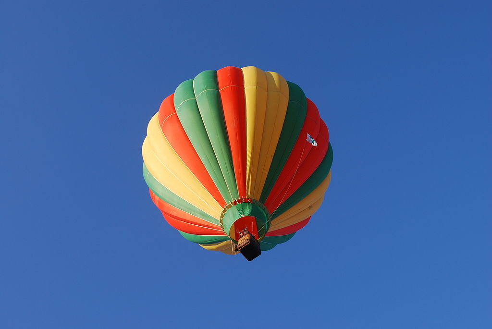

**86/365** Primul zbor al unui **balon cu aer cald** care a transportat oameni a avut loc la 21 noiembrie 1783, la Paris şi a fost realizat de Jean-Francois Pilatre de Rozier şi Francois Laurent d'ARlandes, într-un balon construit în anu 1792 de fraţii Montgolfier. Zborul lor a început la orele 14:00 de la castelul La Muette, ce se află în partea de vest a Parisului, iar balonul s-a ridicat la înălţimea aproximativă de 1km. Zburând aproximativ 9km în timp de 25 de minute, balonul a aterizat pe un deal din cartierul Butte aux Cailles. Mulţimea i-a întâlnit bucuroasă pe noii săi eroi naţionali şi au sărbătorit această primă victorie.
Totuşi, istoria balonului cu aer cald începe mai înainte, când în august 1709 portughezul Bartolomeu de Gusmao a reuşit să ridice la înălţimea de patru metri un balon în miniatură la care era ataşat un vas cu jăratic.

