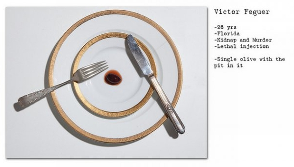

**88/365** În SUA, condamnaţii la moarte au dreptul la ultima masă cu mâncarea pe care şi-o doresc. Poate părea straniu că cineva care ştie că o să moară peste câteva ore să-şi mai dorească o masă şi încă şi specială, dar totuşi, mulţi dintre condamnaţi îşi satisfac pofta pentru ultima oară. Unele mese ale condamnaţilor arătau în felul următor:
- Victor Feguer care fost condamnat pentru că a a furat un copil şi pentru omor, şi-a comandat o singură măslină;
- John Wayne Gacy care a fost condamnat pentru omorul a 33 de oameni a cerut crevete, cartofi fri, pulpe de pui de la KFC şi căpşune proaspete;
- Ronnie Lee Gardner pe lângă lobster, friptură, plăcintă cu mere şi îngheţată a dorit să vizioneze şi trilogia "The lord of the rings";
- Timothy McVeigh, autorul atentatului terorist din Oklahoma în 1995 care a luat viaţa a 166 de oameni, a comandat doar îngheţată de mentă;
- Angel Nieves Diaz care a fost condamnat pentru omor, a renunţat la ultima masă. În timpul execuţiei a avut nevoie de o injecţie adăugătoare şi a decedat peste 34 de minute.

