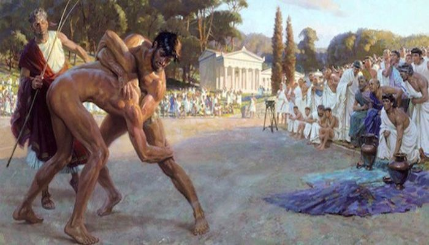

**89/365** La Jocurile Olimpicie din 564 î.e.n., Grecia, a avut loc un caz unic, când câştigătorul unei competiţii a devenit un atlet mort. Pankration, unul din cele mai crude genuri de sport era inclus în lista jocurilor din programa jocurilor olimpice, şi includea lovituri din cele mai grave, inclusiv permitea sufocarea adversarului. Runda nu avea un timp prestabilit, iar jocul continua până cineva câştiga. Competitorul care arăta degetul mare în sus se declara învins.
Arrahion, care câştigase deja titlul de campion la jocurile olimpice trecute, avea un rival, numele căruia istoria nu l-a reţinut. În timp ce aceştia se încăierau, rivalul lui Arrahion l-a apucat pe acesta cu picioarele de gât şi l-a strâns cu putere. Totuşi, Arrahion a reuşit să-i producă durere strângându-i şi sucindu-i cu putere degetul cel mare de la picior. Simţind o durere puternică, acesta a ridicat degetul cel mare sus, în semn că se predă. Când arbitrul s-a apropiat de Arrahion, a observat că acesta era mort, a fost sufocat. Totuşi, arbitrii au hotărât că rivalul lui Arrahion s-a predat înainte ca acesta să moară. Chiar şi mort, el a fost decorat cu coroana din frunze de dafin, aşa cum era primit atunci, iar în oraşul său natal, Figalia, a devenit erou în cinstea cărui s-a ridicat şi un monument, iar numele său apare în lucrările scriiotirol antici greci precum Pausanias şi Filostratus.

