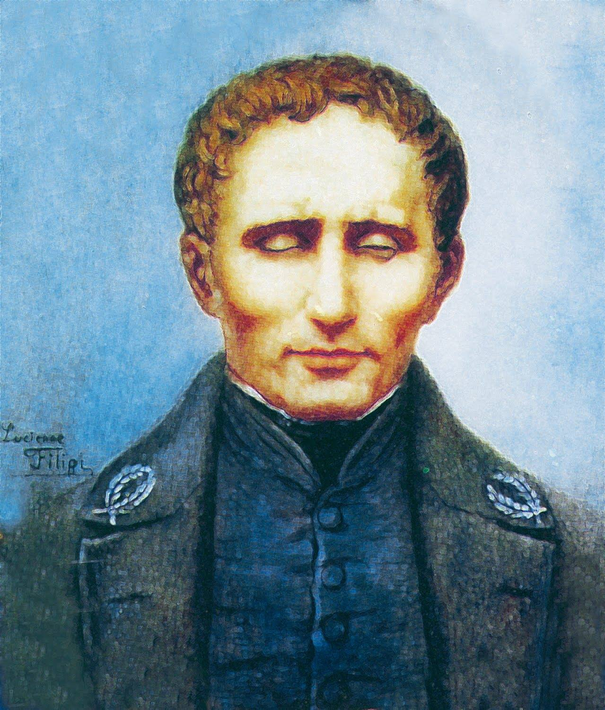

**9/365** Uneori, o tragedie personală, poate schimba spre bine viaţa a milioane de oameni. La 4 ianuarie 1809, se naşte Louis Braille, care la doar trei ani, din cauza unui accident în atelierul tatălui său, începe să-şi piardă vederea, iar la cinci ani deja devenise orb. La 10 ani, părinţii îl dau la studii la institutul naţional al tinerilor orbi din Paris, unde studiază din cărţi cu text reliefat. Totuşi, numărul a astfel de cărţi era foarte redus, şi astfel, unele subiecte erau studiate pe cale orală. Chiar dacă la acel moment, deja exista un sistem de citire pentru orbi, acesta era foarte dificil şi încet. În 1821, la institut, Braille face cunoştinţă cu "scrierea nocturnă", care a fost prezentat de creatorul acestui sistem, Charles Barbier. Acest sistem fusese inventat pentru armată, însă era prea complex şi a fost respins. Cu toate acestea, s-a crezut că ar putea fi folosit de orbi. Totuşi, din cauza că sistemul folosea o matrice cu 6x6 puncte pentru a reprezenta o literă, acesta nu era chiar gata pentru a putea fi folosit, mai ales că era nevoie să-ţi mişti degetele ca să "citeşti" o singură literă. Braille însă a fost inspirat, şi a început să experimenteze. Aşa că, în 1825, la doar 16 ani, Braiile începe să creeze ceva cu adevărat util pentru oamenii nevăzători. Codul său consta în 6 puncte, dispuse pe două şiruri paralele, fiecare set reprezentând o literă. Acest sistem era mai simplu decât sistemul lui Barbier, dar suficient ca să permită până la 64 de variaţii, îndeajuns pentru toate literele şi semnele de punctuaţie. Mai târziu, Braille însuşi devine profesor la institut, şi începe să-i înveţe pe studenţi sistemul său de citire. În 1834, este invitat să demonstreze utilitatea limbajului la Expoziţia Industriei, sporindu-i popularitatea. În ciuda acestui fapt, Institutul naţional al orbilor din Paris încă refuză să accepte limbajul său, şi doar abia, în 1854, la doi ani de la moartea autorului, limbajul fusese adoptat, în timp ce la Amsterdam, la o şcoală de nevăzători, era folosit deja de mai bine de opt ani. Şi uite aşa, o tragedie personală, uneori, poate schimba lucrurile înspre bine pentru milioane de oameni!

