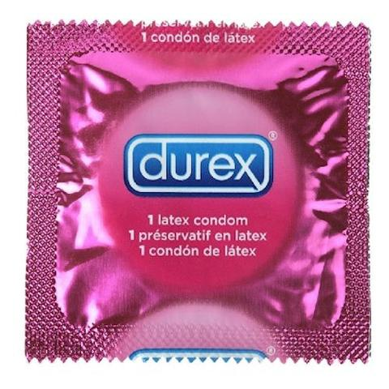

**90/365** Metodele de contracepţie precum **prezervativul** sunt cunoscute de multe sute şi chiar mii de ani. În toată această perioadă, prezervativul a fost confecţionat din diferite materiale şi era folosit sau interzis prin lege în dependenţă de perioadă. Spre exemplu, cu doar 100 de ani în urmă, încă existau prezervative confecţionate din intestin de animal, care erau refolosite de mai multe ori, iar în Germania anului 1941 prezervativele erau interzise prin lege pentru creşterea numărului populaţiei. Pe lângă metoda de contracepţie, acesta mai era des popularizat împotriva bolilor venerice. Unul din cei mai importanţi producători la sfârşitul secolului al XIX-lea şi până în 1914 era Germania, care producea prezervative pentru Europa, Canada, Australia şi Noua Zeelandă. La moment, prezervativele sunt confecţionate din latex şi sunt cea mai populară metodă de contracepţie.

