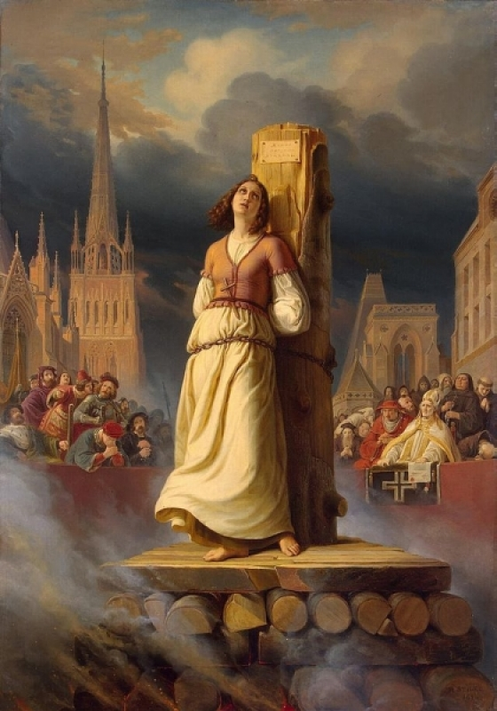

**92/365** Minţile întunecate, frica de ceva nou, religia şi lipsa învăţământului au încetinit mult dezvoltarea omenirii. Oameni care reuşeau totuşi să descopere lucruri noi, riscau în cel mai direct mod, să-şi piardă chiar şi viaţa. Istoria este plină de astfel de istorii cu final tragic. Spre exemplu, în perioada domnirii lui Ioan cel Groaznic, un oarecare personaj, a reuşit să construiască nişte aripi pe care le-ar fi folosit ca să planeze, sărind dintr-o clopotniţă. Experimentul acestuia s-a soldat cu succes, totuşi, căpetenia biserecească a văzut în acest fapt implicarea diavolului, aşa că au poruncit ca experimentatorului să-i fie tăiat capul, iar construcţia sa a fost arsă în faţa mulţimii. Alt exemplu, mult mai cunoscut, este acel al scriitorului şi filosofului italian, Giordano Bruno. Acesta a fost ars pe rug la 17 februarie 1600, în piaţa Campo dei Fiori, la Roma, Italia. I s-a cerut să renunţe la ideile sale, refuzând însă, a fost declarat eretic, vinovat de blasfemie şi comportament imoral. Un al treilea exemplu de prostie omenească poate fi reprezentat de perioada în care arderea femeilor cu ochi verzi şi păr roşcat era o normalitate. Acestea erau considerate a fi vrăjitoare trimise din iad, iar părul roşcat era dovada clară că e culoarea focului care arde veşnic. Cine ştie unde ar fi acum omenirea dacă nu exista această perioadă întunecată în istorie?

