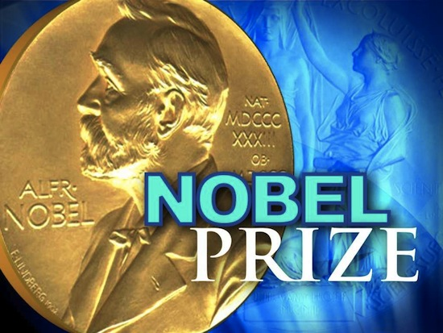

**93/365** Inventatorul dinamitei Alfred Nobel, este totodată şi autorul premiului care îi poartă numele. Având la activ circa 355 de invenţii, acesta deţinea şi concernul metalurgic Bofors, care a ajuns să fie unul din cei mai mari producători de armament. În toată viaţa sa, Alfred a reuşit să adune averi impunătoare, iar la 1888 i-a murit fratele său, fapt care i-a schimbat viaţa. Din greşeală, ziariştii au scris că de fapt a murit chiar el, iar titlul ştirii suna aproximativ în felul următor: "Vânzătorul de moarte a murit". Citind acest titlu, Alfred s-a întrebat, cum îl v-or ţine minte oamenii după moartea sa, astfel că lasă un testament în care indică ca din banii săi, care erau păstraţi într-un cont bancar, să fie anual premiaţi câteva persoane care şi-au adus contribuţia în serviciul umanităţii. La ziua de azi, există şase categorii pentru **premiile Nobel**, precum chimia, fizica, medicina, economia, literatura şi premiul pentru pace. Primele premii Nobel au fost acordate la 10 decembrie 1901, după moartea lui Alfred Nobel. Iniţial acestea constau din o medalie, o diplomă şi 40.000$ SUA. Interesant este faptul că evreii deţin circa 25% din toate premiile Nobel, în timp ce populaţia acestora în raport cu populaţia Pământului e de doar 0.2%.

