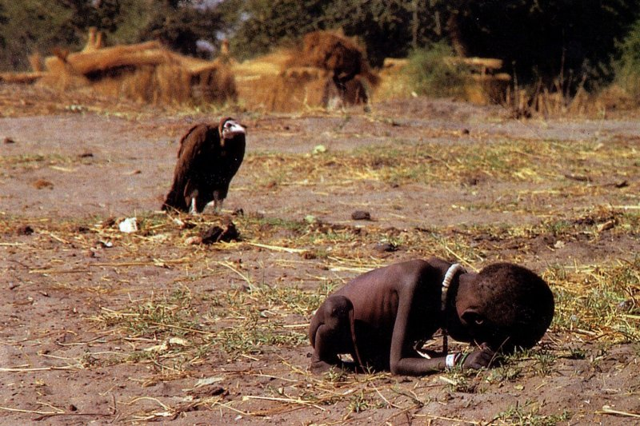

**94/365** Fotografia de mai jos a devenit istorie. Exact asta s-a întâmplat şi cu viaţa celui care a făcut-o. În 1993, în Sudan, fotograful Kevin Cartner face această fotografie pentru care primeşte premiul Pulitzer, unul din cele mai importante premii pentru fotografie, iar câteva luni mai târziu acesta se sinucide, simţind o presiune enormă, fiind întrebat de mii de ori şi învinuit că nu a intervenit în acel moment, pentru a salva copilul din imagine. Părinţii copilului în acel moment erau ocupaţi să primească hrana repartizază ca ajutor umanitar, iar Kevin primise ordin clar, să nu se apropie de localnicii bolnavi de malarie. După ce fotografia fusese publicată în "The New York Times", oamenii vor să afle ce s-a întâmplat cu fetiţa din imagine, aşa că Kevin este asaltat cu întrebări şi reproşuri. Deşi copilul din imagine a supraveţuit, oamenii deja nu mai vor să audă asta, şi-l acuză că înainte de a face fotografia era om, nu şi după. La 27 iulie 1994, Kevin, se sinucide la nici 34 de ani împliniţi. Lasă o scrisoare în care scrie că-i pare rău, că e vânat de imaginile morţii pe care a reuşit să le vadă pe parcursul vieţii, de execuţii publice, de amintirile copiilor morţi. Peste un timp, câteva organizaţii merg în Sudan să afle care a fost soarta de mai departe a fetiţei, şi descoperă că de fapt a fost un băieţel, care a decedat de febră galbenă în 2008.

