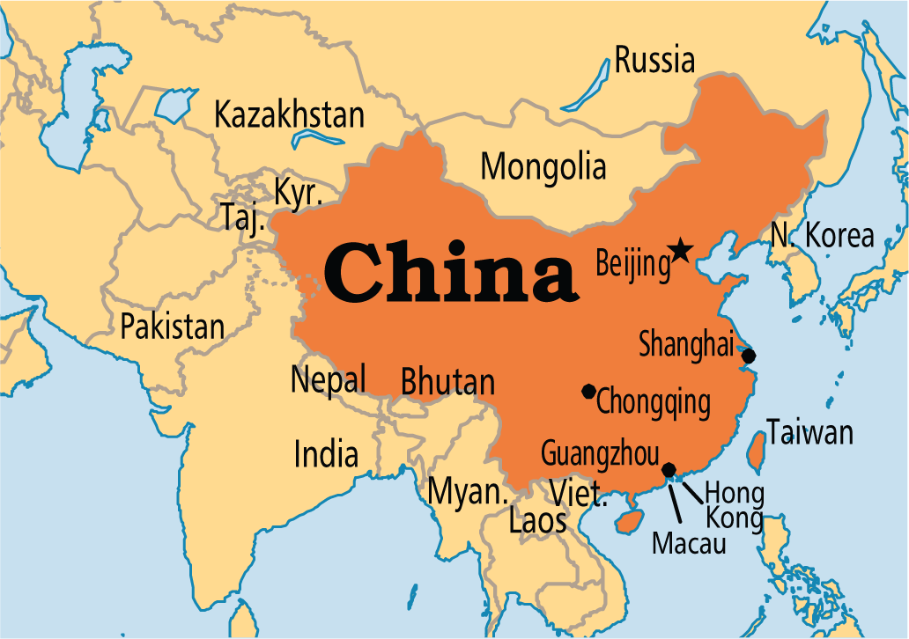

**95/365 China** este ţara care are cele mai multe ţări vecine. Hotarele terestre cu lungimea de 22.117km se intersectează cu 14 ţări: India, Pakistan, Afganistan, Tadjikistan, Kârgâzstan, Kazahstan, Mongolia, Rusia, Coreea de Nord, Vietnam, Laos, Mianmar, Butan şi Nepal. Ţara cu 13 ţări vecine este Rusia.

