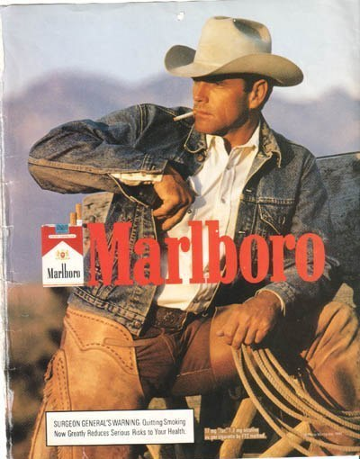

**96/365** Unii din voi poate mai ţin minte publicitatea ţigărilor **Marlboro** asemănătoare cu cea din poza de mai jos. Începând cu anul 1954 şi pân în anul 1999, aceasta populariza ţigările Marlboro cu filtru, care iniţial erau dedicate femeilor. Publicitatea ne demonstra un cowboy care fumează o ţigaretă pe fonul naturii şi a avut efectul scontat, astfel dacă în 1955 vânzările se ridicau la 5 miliarde anual, în 1957 acestea aduceau un venit de 20 miliarde de dolari. Pe parcursul timpului, mai mulţi actori au jucat roluri în această publicitate, dar ironia sorţii e că patru din eu într-un final au murit de cancer de plămâni.

