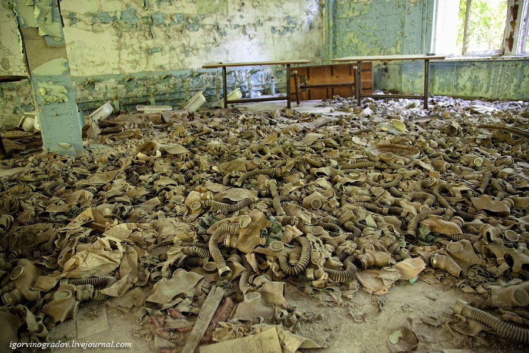

**97/365** La 26 aprilie 1986 are loc una din cele mai mari **catastrofe nucleare** din istorie, urmările cărora se resimt şi astăzi. Din cauza unor erori de ordin uman, la orele 1:23 noaptea, la centrala atomică de la Cernobîl, Ucraina, are loc o explozie puternică care împrăştie în atmosferă o cantitate uriaşă de substanţe radioactive. Din cauza vântului şi a aflării localităţii în imediata apropiere a Belarusului, peste 60% din substaneţe radioactive cad pe teritoriul acesteia, astfel, Belarusul fiind cea mai afectată ţară. Explozia a fost într-atât de puternică, încât scutul superior al clădirii cu o greutate de 1000 de tone a fost pur şi simplu pulverizat. Incendiul a durat 10 zile, până s-a reuşit stingerea acestuia. La 36 de ore de la producerea accidentului, 45.000 de locuitori ai oraşului Pripiati, acolo unde locuiau majoritatea muncitorilor de la centrală, şi care se află la 2km de Cernobîl, au fost evacuaţi cu autobuzele. La 5 mai, toţi cei care locuiau pe o rază de 30km de la zona accidentului, peste 130.000 de persoane, au fost nevoiţi să părăsească zona. Teritoriul a fost declarat zonă specială şi era nevoie de un permis pentru a pătrunde în perimetru. Chiar dacă zona a fost declarată închisă, totuşi câteva sute de oameni, în special bătrâni s-au întors la casele lor. Din cauza secretomaniei conducerii URSS-ului, multe lucruri s-au făcut cu întârziere sau chiar deloc. Spre exemplu, doar la 23 mai au început pregătirile pentru a distribui populaţiei iod, mult prea târziu, deoarece iodul radioctiv fusese eliberat în atmosferă în primele zece zile. Cu părere de rău, nu se cunoaşte numărul exact de persoane care au suferit din cauza acestei catastrofe. În timp ce unele surse afirmă că numărul oamenilor decedaţi din cauza catastrofei se ridică la aproape un milion de oameni, alte sursă afirmă că au decedat 9.000 de persoane, iar altele 200.00 suferă de diferite boli, iar peste 5 milioane de oameni continuă să locuiască pe teritoriile contaminate.

