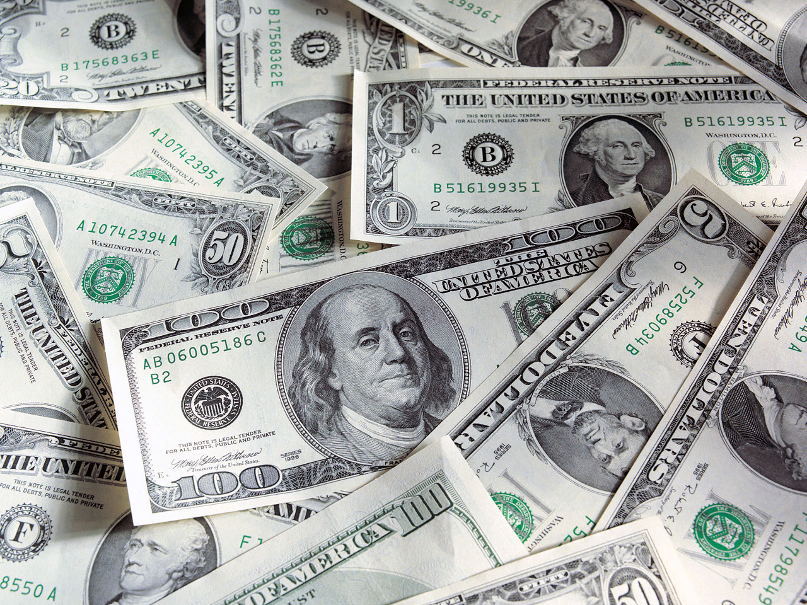

**98/365 Dolarii americani** nu conţin niciun gram de hârtie. Aceştia sunt făcuţi dintr-un amestec de in şi bumbac şi dacă priviţi atent veţi observa fire de mătase de culoare roşie sau albastră de-a lungul bancnotei.

