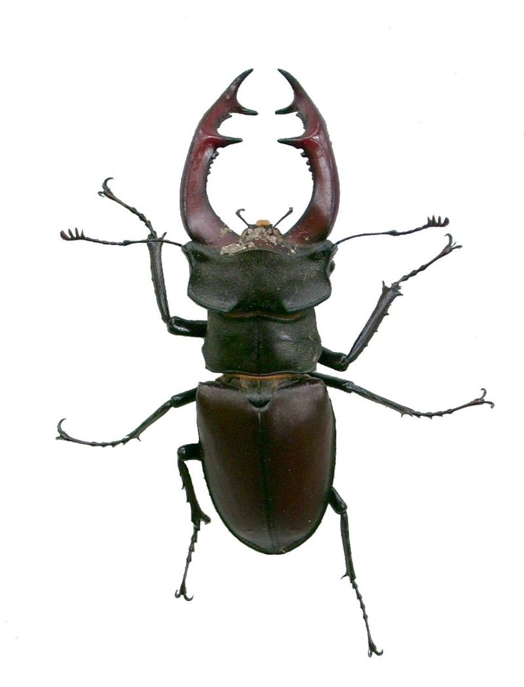

**99/365 Rădaşca** se numără printre cele mai mari şi mai remarcabile insecte din Europa. Acestea ajung să aibă până la 100mm lungime şi doar coarnele pot avea jumătate din lungimea insectei. Totuşi femelele nu au coarne, ci doar cleşte mici care sunt folosit pentru a accesa hrana. Interesant este faptul că larva se dezvoltă până la maturitate de la trei la şapte ani, iar insecta matură trăieşte doar câteva luni, şi de obicei mor în august.

